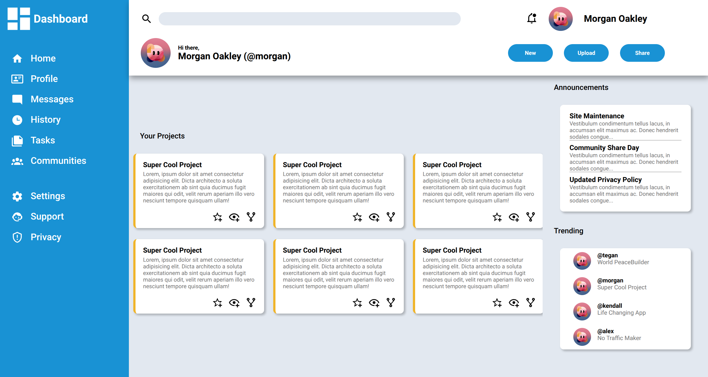

# Admin Dashboard

This is a Admin Dashboard project created as part of The Odin Project's Intermediate HTML and CSS curriculum. It includes a sidebar, header, project display area, announcements, and trending sections, simulating a dashboard for managing projects and viewing key updates.

## Features

- **Header Section**: Includes a search bar, notification section, user profile section, and action buttons.

- **Sidebar**: Navigation links to different sections, such as Home, Profile, Messages, etc.

- **Project Section**: Displays a list of projects with options to
  interact (star, view, fork).

- **Announcement Section**: Shows site announcements

- **Trending Section**: Highlights trending users and projects.

## Technologies Used

- HTML5
- CSS3 (Grid and Flexbox)
- Google Fonts (Roboto & Open Sans)

## Screenshot

> **Note**: This project is not completely finished to my liking and may undergo further improvements in the future.
